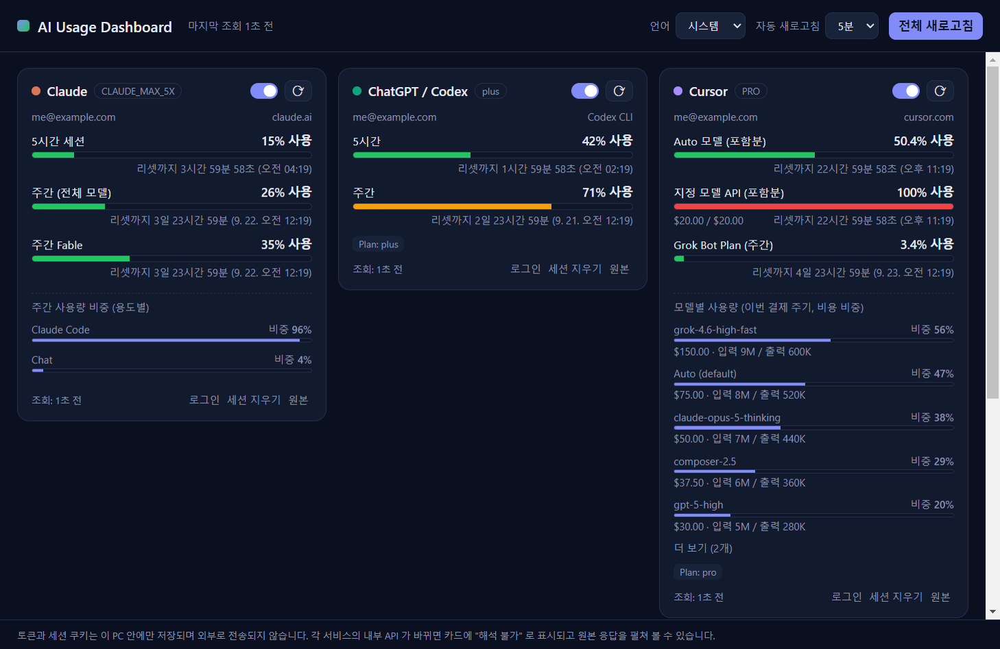

# AI Usage Dashboard

Claude · ChatGPT/Codex · Cursor · Gemini · Perplexity · Grok 의 **사용량과 다음 리셋까지 남은 시간**을 한 화면에서 보여주는 데스크톱 앱입니다. Windows 와 macOS 를 지원합니다 (Electron). UI 는 시스템 언어가 한국어면 한국어, 아니면 영어로 표시되며 상단에서 바꿀 수 있습니다.

*English summary: a Windows/macOS desktop dashboard showing usage and time-to-reset for Claude, ChatGPT/Codex, Cursor, Gemini (Antigravity), Perplexity and Grok. Claude Code / Codex CLI / agy credentials are detected automatically; other services are signed in inside the app and read through the same internal endpoints their web dashboards use. The UI follows the system language (Korean or English). Run with `npm install && npm start`; build with `npm run dist:win` / `npm run dist:mac`.*


(목업 데이터로 만든 화면. `npx electron scripts/mock-shot.js docs/screenshot.png ko`)

## 다운로드 (Windows)

빌드된 실행파일은 저장소의 [`release/`](release/) 폴더와 [Releases](https://github.com/poohcom/ai-usage-dashboard/releases) 페이지에 있습니다.

- `AI-Usage-Dashboard-<버전>-win-x64-setup.exe`: 설치형
- `AI-Usage-Dashboard-<버전>-win-x64-portable.exe`: 설치 없이 실행

코드 서명이 없어 처음 실행 시 SmartScreen 경고가 뜨면 "추가 정보 → 실행"을 누르면 됩니다.

## 실행

```bash
npm install
npm start
```

배포용 설치 파일 만들기:

```bash
npm run dist:win   # Windows: dist/ 아래 NSIS 설치 파일 + portable exe
npm run dist:mac   # macOS: dist/ 아래 dmg + zip (macOS 에서 실행해야 함)
```

## 서비스별 데이터 수집 방식

각 서비스는 공식 "사용량 조회 API" 를 제공하지 않으므로, 해당 서비스의 웹/CLI 클라이언트가 실제로 쓰는 내부 엔드포인트를 그대로 사용합니다. 모든 토큰과 세션 쿠키는 이 PC 의 Electron 사용자 데이터 폴더에만 저장되고 외부로 전송되지 않습니다.

| 서비스 | 인증 | 표시 항목 |
|---|---|---|
| Claude | ① Claude Code 로그인 자격증명 자동 인식 (`~/.claude/.credentials.json`, macOS 는 Keychain) ② 없으면 앱 안에서 claude.ai 로그인 | 5시간 세션, 주간(전체 모델), 모델별 주간(예: Fable) 사용률과 리셋 시각, 용도별(Claude Code/채팅/Cowork) 주간 비중, 추가 사용량 |
| ChatGPT / Codex | ① Codex CLI 자격증명 자동 인식 (`~/.codex/auth.json`) ② 없으면 앱 안에서 chatgpt.com 로그인 | ChatGPT 플랜의 Codex 5시간/주간 한도, 리셋 시각, 플랜 |
| Cursor | 앱 안에서 cursor.com 로그인 | Auto 모델 / 지정 모델 API / 전체 포함분 사용률, 온디맨드, Grok Bot 주간 한도, 결제 주기 종료(리셋) 시각, 이번 주기 모델별 비용·토큰 비중 |
| Gemini / Antigravity | ① 카드의 [Google 로그인] (브라우저에서 Google 계정 로그인, Antigravity 공개 OAuth 클라이언트 사용) ② agy CLI / Antigravity 가 저장한 토큰 자동 인식 ③ Gemini CLI 토큰(구형, 서버가 거부할 수 있음) | 모델 그룹별(Gemini 모델 / Claude·GPT 모델) 주간·5시간 남은 비율과 리셋 시각, 티어 |
| Perplexity | 앱 안에서 perplexity.ai 로그인 | 무료 검색 / Pro / Research / Labs 남은 횟수, 모델별 한도(응답에 있을 때), 크레딧 |
| Grok | 앱 안에서 grok.com 로그인 | 모델·요청 종류별 남은 쿼리 수 / 창 크기 |

- **로그인 방식**: 카드의 [로그인] 버튼을 누르면 해당 서비스 전용 브라우저 창이 열립니다. 평소처럼 로그인하고 창을 닫으면 세션이 저장되어 이후 자동으로 조회합니다. [세션 지우기] 로 저장된 쿠키/토큰을 삭제할 수 있습니다.
- **Gemini / Antigravity**: Gemini CLI 의 개인용 로그인은 Google 이 중단했습니다("This client is no longer supported ... migrate to Antigravity"). 이 앱은 Antigravity 의 설치형 앱용 OAuth 클라이언트로 Google 로그인해 같은 Code Assist 쿼터 API(`retrieveUserQuotaSummary`)를 호출합니다. 클라이언트 id/secret 은 **소스에 들어 있지 않고**, 이 PC 에 설치된 `agy` CLI 또는 Antigravity IDE 실행파일에서 런타임에 추출합니다(둘 다 없으면 `ANTIGRAVITY_OAUTH_CLIENT_ID` / `ANTIGRAVITY_OAUTH_CLIENT_SECRET` 환경변수로 지정). 토큰은 OS 암호화(safeStorage)로 앱 데이터 폴더에 저장됩니다.
- **CLI 자격증명**: Claude Code / Codex 토큰이 만료된 경우 앱은 토큰을 갱신하지 않습니다(CLI 가 저장한 refresh token 을 무효화할 수 있기 때문). 터미널에서 `claude`, `codex` 를 한 번 실행하면 CLI 가 갱신하고 앱이 다시 인식합니다. Google 토큰은 refresh token 이 회전하지 않아 앱 메모리/앱 저장소에서만 갱신합니다.
- **ChatGPT 대화 메시지 한도** 는 조회 API 가 없어, ChatGPT 플랜에 포함된 Codex 한도(5시간/주간)를 표시합니다.

## 동작

- 기본 5분마다 자동 새로고침 (상단에서 1~30분 선택). 리셋 카운트다운은 1초마다 갱신됩니다.
- 카드 머리글을 드래그해서 순서를 바꿀 수 있고, 바뀐 순서는 설정에 저장됩니다.
- 창을 닫아도 트레이(메뉴바) 아이콘으로 남습니다. 트레이 아이콘 툴팁에 요약이 표시되고, 트레이 메뉴의 [종료] 로 완전히 종료합니다.
- 카드의 [원본] 버튼으로 서비스가 돌려준 원본 JSON 을 볼 수 있습니다. 서비스의 내부 API 가 바뀌어 해석에 실패하면 이 원본으로 `src/providers/*.js` 의 파서를 고치면 됩니다.
- 설정 파일: Windows `%APPDATA%\ai-usage-dashboard\settings.json`, macOS `~/Library/Application Support/ai-usage-dashboard/settings.json`
  - `grokModels`: Grok 에서 조회할 모델명 목록 (기본 `["grok-4", "grok-3"]`)
  - `language`: `auto`(시스템 언어) | `ko` | `en`

## 디버그

Cursor 세션으로 사용량 API 원본을 덤프하려면 (앱 종료 후):

```bash
npx electron scripts/dump-cursor.js
```

```bash
AIUSAGE_DEBUG=1 npm start        # 서비스별 결과를 콘솔에 출력 (raw 제외)
AIUSAGE_DEBUG=2 npm start        # raw 응답까지 출력
AIUSAGE_SCREENSHOT=out.png npm start   # 실행 20초 뒤 메인 창을 PNG 로 저장
```

## 구조

```
src/main.js            Electron 메인: 창/트레이/스케줄러/IPC
src/preload.js         렌더러에 노출하는 안전한 API
src/lib/siteSession.js 서비스별 영구 세션 숨김 창에서 같은 출처 fetch 실행
src/lib/creds.js       Claude Code / Codex / agy / Gemini CLI 자격증명 읽기, Antigravity OAuth 클라이언트 런타임 추출
src/lib/googleOAuth.js Google OAuth(루프백) 로그인 + 토큰 저장/갱신
src/lib/i18n.js        한국어/영어 문자열 사전
src/providers/*.js     서비스별 조회 + 정규화 ({ windows:[{label, usedPct, resetAt}], extra, raw })
src/renderer/          대시보드 UI
```
